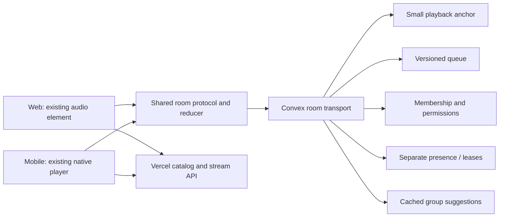

# Listen Together: Spotify Jam comparison and enhancement plan

Prepared 2026-10-06. Status: proposed; no application changes or deployment authorized by this plan.

## Recommendation

Improve correctness before adding social features. Deliver one vertical slice at a time: sync and lifecycle fixes, then a shared queue, speaker mode, browser joining, and cached group recommendations.

The existing Listen Together feature does **not** use Convex for its room transport. It uses a public Echo/Metrolist WebSocket server. Keep that distinction clear when discussing cost: a first-party Convex room implementation adds usage relative to today's room transport, but provides control over authentication, ordering, invitations and capabilities. Optimize the new design against an equivalent naive Convex design; do not claim savings against today's zero-direct-Convex room traffic.

Recommended destination: small, event-driven first-party Convex rooms, using the existing audio players and Vercel catalog API. Preserve Echo compatibility as an explicit legacy room mode if it remains a product requirement. Never run both transports for the same room. Avoid adding a second hosted realtime service until measured traffic demonstrates that Convex is the wrong tradeoff.

## Research and evidence boundary

Research used both Firecrawl and Context.dev, with single searches and page scrapes, no crawls, batch jobs or monitors. Context independently retrieved Spotify support and found the January 2026 Request to Jam release. Firecrawl retrieved Spotify support, newsroom, the older community FAQ, the current Metroserver README and Convex's scaling guidance.

The code findings below describe the current checkout. They do not establish live server behavior, production Convex bills, physical-device drift, or Spotify's internal synchronization algorithm. Spotify does not publish its Jam clock/control implementation in these product sources. Its older FAQ has broader volume wording than current support; prefer current support. No currently verified participant limit is assumed.

Local baseline verification: ran the existing mobile Listen Together client, sync and codec test files with Jest `--runInBand`; all **3 suites / 18 tests passed**. `git diff --check` passed. Full root/mobile gates were not rerun for this documentation-only plan. No live room, production usage audit or physical audio measurement was performed.

## What Spotify has versus this implementation

| Capability | Spotify Jam | Allegra / LuvLyrics today | Priority |
| --- | --- | --- | --- |
| Remote listening | Independent devices listen together; Premium rules apply | Mobile host/follower playback exists | Improve sync first |
| Shared queue | Participants contribute; host manages order/removal; contributor attribution | Queue message types exist, but sync ignores queue edits and followers load a one-song queue | P1 |
| Contributions without playback control | Guests can add while host retains transport control | Host receives suggestions, but no outgoing suggestion sender found | P1 |
| Guest transport controls | Host can allow or disallow changes to playback | Incoming permission flag and `canControl` exist; no sender/UI for updating it found | P1 |
| In-person listening | One speaker/output plays; participants control from their phones | No explicit controller-only speaker mode | P2 |
| Joining | Links, QR, Bluetooth proximity and same-Wi-Fi prompts | Room code and `lyricflow://together?code=...`; no room QR or browser landing flow | QR/link P2; discovery later |
| Group recommendations | Group taste informs suggestions; visible contribution context | No room recommendation shelf; existing Blend ranking can be adapted | P3 |
| Desktop participation | Native desktop Jam supported | No Listen Together implementation found in `apps/web` | P2 |
| Device ecosystem | TV, Android Auto and CarPlay; speaker integrations | Native phone playback and separate same-account Connect; no matching room integrations | Later |
| Shared speaker volume | Host permission; supported Chromecast/Amazon Cast outputs; excludes Bluetooth/AirPlay shared control | Optional host-volume matching on guest phones, enabled by default | Change semantics in P2 |
| Social invitations | Request to Jam from Messages, alongside opt-in listening activity | No equivalent friend/request surface found in room implementation | Later |
| Moderation / continuity | Host removes guests; host leaving ends Jam | Approve/decline, kick, local name block, manual host transfer, reconnect already exist | Harden existing features |

Spotify support and launch details: [current Jam help](https://support.spotify.com/us/article/jam/), [Jam launch and platform updates](https://newsroom.spotify.com/2023-09-26/spotify-jam-personalized-collaborative-listening-session-free-premium-users/). Desktop here means Spotify's native desktop app; do not equate that with its browser player.

The January 2026 [Request to Jam announcement](https://newsroom.spotify.com/2026-01-07/listening-activity-request-to-jam-messages-updates/) describes invitations from Messages, acceptance/decline, and the recipient becoming host. This is a discovery feature, not evidence that Jam requires building a chat system. Prioritize a good invite link before messaging.

## Current code: strengths and concrete gaps

### Room transport and state

- `apps/mobile/src/services/listenTogether/client.ts:35-43,86-124`: public server discovery/fallback, one protobuf WebSocket, 25-second ping, jittered reconnect. Room traffic does not call Convex.
- `client.ts:170-373,441-520`: create/join approvals, participants, reconnect, kick, host transfer, incoming suggestions and permission updates already exist.
- `apps/mobile/src/store/listenTogetherStore.ts`: preferences and session token persist in AsyncStorage. Blocking is by display name and enforced by the client; it is not durable identity-based server moderation.
- `apps/mobile/src/services/listenTogether/protocol.ts:16-25,47-61`: suggestion, settings and queue operations are declared. Declarations are not completed features.
- `apps/mobile/src/components/listenTogether/ListenTogetherPanel.tsx:126-237`: room code/deep-link sharing, people, approvals and incoming suggestion controls; no shared queue or QR.
- The current [Metroserver README](https://github.com/MetrolistGroup/metroserver) documents configurable client User-Agent hosting policy and restart persistence. Confirm the actual deployed endpoint's capabilities with the real app; neither README policy nor successful unit tests proves LuvLyrics can host there today. Do not spoof another app to bypass policy.

### Sync correctness

- `sync.ts:37-43`: 2-second position tolerance, 3-second playing tolerance, 10-second host PLAY heartbeat.
- `sync.ts:126-139`: seeks inferred from a one-second position poll; jumps under 2.5 seconds can be missed.
- `sync.ts:152-193`: local title/artist matching, then catalog mapping; followers receive a single-song queue. Same title/artist does not prove the same recording/master.
- `sync.ts:195-249`: readiness polls every 100 ms up to 12 seconds; after timeout the branch can still attempt playback. Pending position can age while loading/barrier waits.
- `sync.ts:257-336,358-436`: received server timestamps are compared directly with `Date.now()`; no server-clock offset estimate. A controller-wide 300 ms ignore window can suppress someone else's genuine action. Sync-state updates currently bypass guests allowed to control because `followsRoom()` means `!canControl()`.
- `sync.ts:440-466`: periodic drift correction and seek detection live in JavaScript. Android background suspension must be tested; a foreground timer is not screen-off reliability.
- Queue actions fall through without application. Skip actions use the local player's queue, which may differ between participants.
- On participant join, host `announceCurrent()` rebroadcasts CHANGE_TRACK; check whether this unnecessarily reloads/pauses existing listeners. Send only the new member a current snapshot in an owned protocol.

These are source-level risks to reproduce, not claims that every scenario currently fails.

### Connect and reusable code

- `apps/mobile/src/services/connect/ConnectProvider.tsx:129-286` keeps Connect alive and marks the device `canPlay: !roomActive`. Room participation does not automatically eliminate Connect subscriptions/presence work.
- Preserve its account/device visibility and interruption protection. Measure overlap before suspending anything; do not globally disable Connect or make a room phone appear offline incorrectly.
- `apps/mobile/src/services/NativeAudioPlayer.ts` already exposes native queue operations, queue events and speed/pitch parameters. Use its ownership/tag and serial-operation rules; add an adapter rather than another player.
- `packages/shared/blendBuild.ts:88-165` has bounded candidate generation, member balancing, attribution and artist spacing. Reuse the ranking kernel for room suggestions; do not create persistent Blend memberships merely to obtain room recommendations.
- `apps/mobile/src/services/ytmusic/resolver.ts:94-111` already caches matches. Add missing in-flight deduplication and bounded next-track preparation where needed rather than replacing caching wholesale.

## Architecture decision

| Option | Direct room Convex usage | What it enables | Limitation |
| --- | --- | --- | --- |
| Harden current public WebSocket | None for room messages | Client lifecycle improvements and protocol-supported features | Public server policy, no owned auth/capabilities, existing clock/protocol limits |
| First-party event-driven Convex rooms | Bounded writes and reactive deliveries | Ordered queue, controlled permissions, owned invites, web/mobile parity | Requires measuring calls, reads, bandwidth, presence and background behavior |
| Owned dedicated realtime relay | Can keep hot room packets outside Convex | Custom ephemeral low-latency protocol | Additional hosting/operations and current repo deployment-rule change; not the initial plan |

Use the public transport for short-term compatibility fixes. Use first-party Convex rooms for full Jam parity. First-party and legacy codes must be distinguishable; never silently migrate an existing mixed Echo room.

### Proposed first-party boundaries

Audio remains local/provider streamed. No audio relay, Convex audio storage, per-second progress writes or server process timers.

Proposed tables, names subject to schema review:

- `listeningRooms`: owner, mode, membership/policy revision, expiry, protocol version. Rarely changes.
- `listeningPlayback`: room id, leader/device id, leader epoch, sequence, track/queue-entry identity, position seconds, server anchor timestamp, playing, playback rate and effective start time. Small hot document.
- `listeningQueueItems`: stable entry id, room id, ordering key, provider-qualified song ref, bounded snapshot, added-by member id. Queue metadata revision separate from playback.
- `listeningMembers`: authenticated/capability identity, display name, role and listen/controller mode. Raw heartbeat timestamps stay separate.
- `listeningSuggestions`: bounded candidate shelf keyed by membership/consent/seed/build revision. No raw listening histories in public views.
- Bounded command receipts: idempotency keys, results and expiry. Keep only enough to survive retries, not an indefinite event log.

Index room-scoped lookups, invite hashes, member identity and queue ordering. Enforce caps at insert time; a proposed pilot starts with eight members and 100 pending queue entries. These are our resource choices, not Spotify limits.

Use separate playback, queue, member and recommendation subscriptions. Subscribe to participant detail/queue pages only where useful, while keeping authoritative room playback subscribed during listening. Do not read profiles, histories, full queues or raw heartbeat records inside the hot playback query. Selecting fewer fields from a giant document does not avoid that document's read/dependency cost.

Convex's [query scaling guidance](https://stack.convex.dev/queries-that-scale) supports indexed bounded reads and separating frequently updated heartbeat documents from widely read data. Query-result caching does not remove per-client delivery fanout.

## Proper synchronization protocol

1. **Separate transport permission from timeline authority.** Every member follows committed timeline updates. Authorized guests send intents; the server serializes them. Only the designated active playback leader reports anchors and natural track end. Concurrent end events cannot advance twice.
2. **Identify every action.** Carry `commandId`, sender identity, room revision, leader epoch, sequence and track epoch. Reject duplicates, obsolete leaders and wrong-track readiness. Acknowledge application or explicit failure. Replace time-window echo suppression with sender/action identity in owned rooms.
3. **Estimate the shared clock.** Use bounded timestamp exchanges and round-trip samples; favor low-RTT samples, record uncertainty, and project with a monotonic local clock. A one-way `Date.now()` comparison is insufficient. Convex clock exchanges are function calls and belong in the cost budget. Legacy ping lacks a server timestamp: do not invent one or promise clock correction without protocol support.
4. **Project playback locally.** `positionSec = anchorPositionSec + elapsedSec * playbackRate` while playing; clamp to recording duration. Clock correction and anchor age are accounted for. UI animation never writes progress to Convex.
5. **Prepare before starting.** Resolve exact recording, load paused, and report readiness once per track epoch. Prefer real player-ready events to polling. The leader schedules a future effective start after ready clients or a bounded deadline. Late clients join the current projected position; one slow client cannot pause everybody indefinitely.
6. **Correct smoothly.** Proposed same-recording targets: ignore less than ~100 ms; use short, pitch-preserving rate correction around 100–500 ms where supported; seek for persistent/larger error, reconnect, or explicit seek. Initial correction range 0.98–1.02, then restore the user's base rate. Respect speed preferences and unsupported-player fallback. Thresholds must be tuned from physical audio measurements.
7. **Use the same recording.** Prefer canonical catalog refs in owned rooms. Validate version/live/remaster distinctions and duration. Local copies need reliable identity evidence; otherwise resolve the canonical recording. Never pretend two different masters can be synchronized by tighter timing.
8. **Handle lifecycle explicitly.** Network change, background/foreground, expired tokens, host loss and slow loading have named states. Android needs a service-owned room transport/sync path if JavaScript suspension tests fail; port only that bounded responsibility. A JS timer cannot guarantee background sync. Keep iOS fallback explicit.

Pilot acceptance targets, not current guarantees: same-recording stable-network audible drift p95 <=250 ms; stable-network control application p95 <=700 ms; warm reconnect <=3 seconds; no duplicate queue advance; bounded late-load recovery. Report network/player conditions and uncertainty. For a shared speaker, play audio on one output instead of attempting echo-free multi-phone audio. Wireless output latency is outside the database clock alone.

## Convex resource budget

The design objective is **one room change, one small authoritative update**, with local progress and bounded reactive queries.

| Work | Naive design | Proposed behavior |
| --- | --- | --- |
| Playhead | Every participant writes once/second | Zero progress-tick writes |
| Playback anchors | Whole-room state repeatedly written | Leader only, meaningful controls and track changes; proposed checkpoint 30 seconds, relax toward 60 when verified stable |
| Presence | Heartbeat patches room/users | Reuse existing Presence component patterns; separate room presence, proposed 40–60 second cadence with measured offline grace |
| Clock sampling | Continuous sync requests | Small join/reconnect calibration burst and infrequent refresh; piggyback where protocol allows |
| Scrubbing | One mutation per thumb movement | Local preview, committed seek at gesture end; server rate cap |
| Volume | Every slider tick broadcast to all | Remote volume remains local; shared-speaker final/coalesced commands only with permission |
| Queue | Entire queue resent on every event | Idempotent entry operations and revision; bounded queue snapshots on join/recovery |
| Suggestions | Rebuild per client/query/control | One revisioned cached build; explicit refresh and membership/consent invalidation |
| Cleanup | Frequent all-room scan | Indexed bounded expiry work, explicit close and reconcile-on-read |

Illustrative room-hour, eight connected members, excluding real controls and track transitions:

- Naive one progress write/second/member: 8 x 3,600 = **28,800 progress mutation requests/hour**.
- Proposed leader checkpoint every 30 seconds: **120 checkpoint requests/hour**, independent of participant count.
- Example presence heartbeat every 40 seconds: **720 outer heartbeat requests/hour** across eight members. Component internal work and expiry jobs are additional; presence cannot be counted as free.
- Example clock budget: five samples/member at join plus one every five minutes: **136 clock requests in the first hour**, if not piggybacked.
- Playback checkpoints delivered to eight subscribers: approximately **960 playback result deliveries/hour**, plus actual controls and invalidations. Shared caching may reduce backend executions; per-user arguments/dependencies can reduce sharing.

These are design arithmetic, not measured savings or billing units. Against a naive 10-second leader checkpoint, 30 seconds reduces checkpoint frequency from 360 to 120 per hour, but tighter precision still needs a good clock/player algorithm.

Track actual mutation attempts, retries, executed queries, documents/bytes read, subscription result bytes, presence internal work, catalog lookups and correction counts. Compare the same two/eight-member journey before and after. No currency forecast without deployment traffic and current pricing.

## Ordered delivery plan

### P0 — Baseline and current-room reliability

Scope: existing `listenTogether/{client,sync,protocol,codec}.ts`, store, focused tests, Connect interaction and native adapter boundaries.

- Reproduce host/guest join, mid-track join, tiny seek, reconnect, simultaneous controls, slow resolution, host transfer and background playback.
- Add development-only bounded diagnostics only after implementation approval. Record local monotonic stages, packet counts/bytes, resolution/load delay, correction count and measured audible drift. No session replay or persistent production event stream.
- Fix stale pending positions, missed explicit seeks, readiness failure, retry lifecycle and obsolete async results. Replace position-poll seek inference with a committed-seek signal where available.
- Verify deployed legacy protocol capabilities before enabling outgoing suggestions/settings. Keep packet extensions capability-gated.
- Confirm no unwanted reload of established listeners on new-member join. Document limits that require an owned protocol.

Exit: repeatable baseline and correctness tests, real two-phone session, screen-off behavior known, packet volume recorded. Do not lower tolerances blindly on the legacy clock.

### P1 — First-party shared queue, mobile end to end

Scope: proposed `packages/shared/listeningRoom*.ts`, `convex/listeningRooms.ts` plus schema/tests, mobile transport adapter, room sheet and queue routing. Public transport remains opt-in legacy mode.

- Announce additive `docs/listen-together-contract.md` and any HTTP contract additions before implementation.
- Implement authenticated room create/join, approval, member controls and one ordered queue with attribution.
- Guests can contribute when transport control is off. Separate contribution, reorder/remove, transport and speaker-volume permissions.
- Make command retries idempotent. Use queue-entry identity, not song identity, so intentional repeated tracks remain distinct.
- Commit authoritative track changes; only the leader advances on natural completion. Respect native queue tags and avoid independent guest auto-advance/shuffle.
- Apply server clock/anchor protocol and readiness handshake for this slice.

Exit: two phones create/join/add/reorder/skip concurrently and end with identical queue/revision; reconnect recovers; rejected/unauthorized commands cannot mutate another room; one natural end advances exactly once.

### P2 — Speaker mode, links/QR and web participation

- Introduce **Listen on my device** versus **Control the shared speaker**. A controller-only guest never loads audio or reports audio buffering.
- Host chooses exactly one active output. Speaker transfer is acknowledged and epoch-fenced; reuse Connect adapter concepts without exposing another account's private device list.
- Local headphone volume stays local. Shared-output volume needs host permission, bounds and explicit destination. Avoid copying host system volume onto everyone by default in new rooms.
- Add HTTPS invite preview and QR pointing to it, mobile verified app links, browser fallback, expiry and revoke. Legacy invites must preserve server selection or clearly identify their transport.
- Add web room UI in existing glass/token design; preserve the layout-owned audio element and autoplay recovery through **Tap to listen**.
- Start a room from Now Playing or a playlist and seed the ordered queue.

Exit: browser-to-phone and phone-to-browser joins, fresh-browser autoplay recovery, one-output speaker mode, revoked link denial, deep-link cold launch, correct Connect exclusion.

### P3 — Group suggestions with existing Blend ranking

- Adapt `packages/shared/blendBuild.ts` into a bounded room ranking input, avoiding the persistent Blend lifecycle and its six-member product limit.
- Start with a small consenting member seed set and existing song-relation cache; resolve playable catalog rows before publication.
- Balance contributions, artist diversity, overlap and novelty. Exclude current/pending/recent room tracks.
- Key cache by member/learning revisions, bounded seed fingerprint and scorer version; one durable build lease prevents duplicate provider work.
- Debounce membership changes; do not refresh on playhead or seek. Proposed minimum five-minute refresh cooldown unless consent/privacy invalidation requires immediate removal.
- Show only justified copy such as "shared favorite" or "a pick for the group". Per-person likes/attribution require consent. Nonconsenting/guest participants contribute explicitly queued tracks only, with no private-history access.

Exit: simultaneous shelf opening performs one build, departures/learning-off immediately invalidate affected attribution, provider failure leaves queue/playback usable, refresh load measured.

### Later — Small improvements after core acceptance

Manual host handoff and reconnect continuity can distinguish the product. Queue fairness, optional votes and saving the room queue to a playlist are reasonable extensions. Defer Bluetooth/Wi-Fi discovery, social messaging, car/TV interfaces and broadcast-scale rooms until demand and capacity evidence justify them. They introduce permissions, identity, platform and resource work beyond basic Jam parity.

## Verification and release safeguards

- Unit/property tests: clock skew +/-30 seconds, variable/asymmetric latency, old anchors, sequence replay, duplicate commands, host epoch changes, wrong-track readiness, no-op updates, caps and denied room access.
- Queue tests: concurrent adds/reorders, repeated same song, host advance versus guest skip, dropped response retry, provider-unavailable track and removed member.
- Cost tests: no per-second network writes; playback subscription reads no queue/history/raw presence; presence updates do not invalidate queue/recommendations; build cooldown and lease prevent fanout work.
- Physical acceptance: two/eight clients, mixed web/Android where possible, downloaded/canonical streams, screen locked for 20–30 minutes, network switch, host crash, foreground return and output routing.
- Measure audible alignment with a controlled reference recording/external capture. Player position/readiness callbacks are not first-audible-sample evidence. Bluetooth latency gets its own scenario.
- Gates after code changes: root typecheck/lint/tests, `npm run mobile:check`, and native unit tests if Kotlin changes. Run Convex checks without competing mobile checks if timeout contention occurs.
- Shared code changes require `npm run sync:shared`; source-of-truth remains `packages/shared`, not API generated copies. Convex deployment changes additive for old APKs; regenerate via supported tooling. Native release bumps mobile version.
- Preserve playback funnel, seek-resume, duration in seconds, Range 206 and same web audio element. Convert legacy milliseconds at the adapter only.
- First-party membership is server-authorized; invited unauthenticated guests, if retained, need scoped expiring capabilities. Codes/links alone never grant transport authority. Enforce frame/input/payload caps and rate limits. Store new sensitive resume credentials with existing secure storage conventions.
- Extend account export/erase and retention for persistent new room data. Keep session data short-lived; no indefinite activity histories or profile duplication.
- Feature flag rollout: internal two-client pilot, then eight-member pilot; compare usage/drift, then expand. Rollback disables new room creation and permits orderly exit; never writes two transports in parallel.

## Proposed file ownership for future implementation

| Area | Existing / proposed files |
| --- | --- |
| Shared domain | `packages/shared/listeningRoom*.ts` (new), existing song refs/snapshots and `blendBuild.ts` |
| Owned backend | `convex/listeningRooms.ts` (new), schema, room tests, bounded retention/account extensions |
| Mobile | `apps/mobile/src/services/listenTogether/`, room store/components, `NativeAudioPlayer.ts`, playback command/native-service seam |
| Connect interoperability | `apps/mobile/src/services/connect/ConnectProvider.tsx`, shared Connect routing/player-port boundaries |
| Web | New room adapter/components under `apps/web/src`, integrated with existing player and device picker |
| Catalog/recommendations | Existing API catalog/relation/Blend services; additive room recommendation seam only |
| Contracts | `docs/listen-together-contract.md` (new); proposed additions to existing API contract |

Before each multi-file implementation, run Graft's full caller/reference closure for the actual symbols being changed. Inspect current native ownership rules and current dirty work; this plan does not authorize altering unrelated navigation/Blend/performance work.

## Sources

1. [Spotify Jam support](https://support.spotify.com/us/article/jam/) — retrieved independently with Firecrawl and Context.dev.
2. [Jam announcement, including desktop and car updates](https://newsroom.spotify.com/2023-09-26/spotify-jam-personalized-collaborative-listening-session-free-premium-users/) — Firecrawl.
3. [Listening Activity and Request to Jam, January 2026](https://newsroom.spotify.com/2026-01-07/listening-activity-request-to-jam-messages-updates/) — Context.dev.
4. [Spotify community Jam FAQ](https://community.spotify.com/t5/FAQs/Spotify-Jam-sessions/ta-p/5453408) — older 2024 FAQ, secondary to current support.
5. [Metroserver repository and current configuration policy](https://github.com/MetrolistGroup/metroserver) — Firecrawl; deployed endpoint behavior unverified.
6. [Convex: Queries that scale](https://stack.convex.dev/queries-that-scale) — both services; Firecrawl full article.
7. Current checkout source files and Graft results cited above; architecture/contracts/CLAUDE rules checked locally. Product docs lag parts of current implementation, so source takes precedence for implementation inventory.

> Implementation continuation: the historical Spotify Jam research remains here. The approved renamed implementation plan, durable checklist, handoff and live status are now maintained in [.planning/luvlink/PLAN.md](../luvlink/PLAN.md), [CHECKLIST.md](../luvlink/CHECKLIST.md), [HANDOFF.md](../luvlink/HANDOFF.md), and worker status notes. Continue from the checklist rather than treating this research document as a current progress report.

> Implementation continuation: historical Spotify Jam research is preserved here. The renamed execution plan, checklist and handoff are maintained in [PLAN.md](../luvlink/PLAN.md), [CHECKLIST.md](../luvlink/CHECKLIST.md) and [HANDOFF.md](../luvlink/HANDOFF.md). Continue from the checklist instead of interpreting this research document as current progress.
