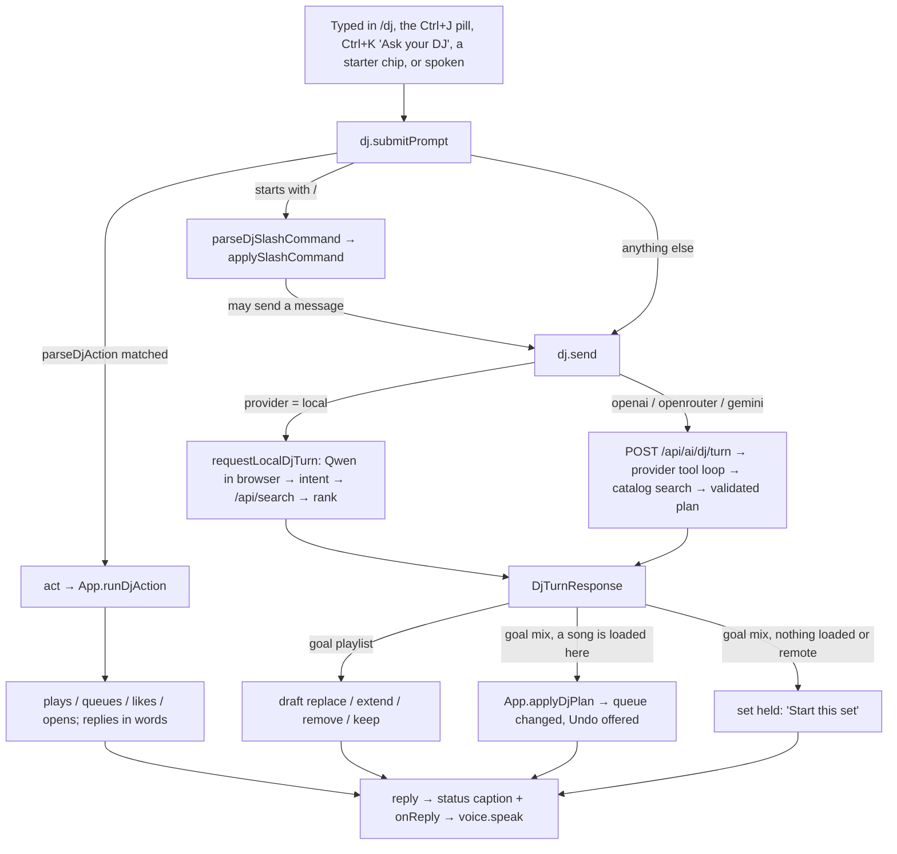
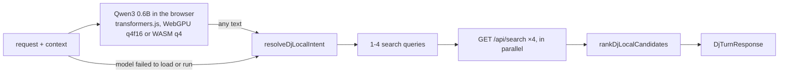

# Your DJ: how it works, front to back

Written 2026-10-10 from the code on `codex/dj-companion` (most of it still uncommitted when this was
written). It covers the `/dj` page, the DJ on every other page, the logic behind it, and the three API
routes. Plans and owner decisions live in [`.planning/dj-companion/`](../.planning/dj-companion/); this
doc explains what the code does today.

## Contents

1. [What the DJ is](#1-what-the-dj-is)
2. [Where the code lives](#2-where-the-code-lives)
3. [One request, end to end](#3-one-request-end-to-end)
4. [The page: layout and UX](#4-the-page-layout-and-ux)
5. [The mascot](#5-the-mascot)
6. [The DJ on every other page](#6-the-dj-on-every-other-page)
7. [Session state and memory](#7-session-state-and-memory)
8. [App commands (the DJ's hands)](#8-app-commands-the-djs-hands)
9. [Applying a set to the queue](#9-applying-a-set-to-the-queue)
10. [The brain: on-device or your key](#10-the-brain-on-device-or-your-key)
11. [Voice: ears and speech](#11-voice-ears-and-speech)
12. [Backend: the three routes](#12-backend-the-three-routes)
13. [Storage and privacy](#13-storage-and-privacy)
14. [Motion and accessibility rules](#14-motion-and-accessibility-rules)
15. [Tests](#15-tests)
16. [Known gaps and things to watch](#16-known-gaps-and-things-to-watch)

---

## 1. What the DJ is

A music companion that sits on its own page (`/dj`) and can be reached from any page. The listener talks to it, by typing or by voice, and it does one of three things:

- **Carries out an app command on the spot:** "play Kesariya and start karaoke", "play my Gym playlist", "like this", "skip", "open my library". No AI model is involved. A parser reads the words and the app acts.
- **Plans music:** "late night Tamil melodies", "more energy", "something like this". A model (on the device, or a cloud model with the listener's own key) turns the request into catalog searches. Allegra's own code searches the real catalog and picks songs, and each pick comes with a one-line reason.
- **Handles a slash shortcut:** `/late-night`, `/playlist`, `/size 6`, `/settings`.

It has two goals, switched with one tap:

- **Mix:** shapes what plays next in the live queue.
- **Playlist:** builds an editable draft the listener can save as a playlist. A draft never touches playback.

Each of its three abilities (thinking, hearing, speaking) has a free option that runs in the browser or on the device, plus an option that uses the listener's own API key. Keys are never stored.

---

## 2. Where the code lives

### Shared types (`packages/shared`)

| File | What it holds |
|---|---|
| `dj.ts` | Request and response types (`DjTurnRequest`, `DjTurnResponse`, `DjSessionState`, `DjLocalIntent`), the slash commands and their parser. |
| `djLocal.ts` | The on-device brain's logic: turning model output into an intent, the no-model fallback, and the song ranking. Pure, tested in `djLocal.test.ts`. |

### Web, logic (`apps/web/src/lib`, `apps/web/src/hooks`)

| File | What it holds |
|---|---|
| `hooks/useDjSession.ts` | **The one DJ session for the whole app** (`useDjSessionState`, provided through `DjSessionContext`). Conversation, goal, draft, emotion, and routing of each request. |
| `hooks/useDjVoice.ts` | **Ears and voice for the whole app** (`useDjVoiceState`, provided through `DjVoiceContext`). Mic, recognisers, "Hey DJ", speech output. |
| `lib/djActions.ts` | `parseDjAction`: text to an app command, or `null` (send it to the model). |
| `lib/djSession.ts` | Pure helpers: stored provider choice, slash outcomes, session edits, reorder helpers, starter ideas, sessionStorage memory. |
| `lib/djLocal.ts` | Loads Qwen3 0.6B in the browser and runs a local turn. |
| `lib/djWhisper.ts` | On-device speech to text (Moonshine base, falling back to Whisper tiny.en). |
| `lib/djLocalSpeech.ts` | On-device text to speech (Kokoro-82M). |
| `lib/djSpeechCapture.ts` | Voice-activity detection, 16 kHz resampling, WAV encoding, base64. |
| `lib/djMascotMotion.ts` | The mascot's body as numbers: springs, drift, beat nods, blinks, gaze, reactions, onset detector. |
| `lib/djStageShape.ts` | The SVG path that cuts the stage and console into one piece of glass. |
| `lib/djDance.ts` | Session tone (amber, violet, blue, coral) and the colours used when nothing plays. |
| `lib/api.ts` | `requestDjTurn`, `requestDjTranscription`, `requestDjSpeech`. |

### Web, UI (`apps/web/src/components`)

| File | What it renders |
|---|---|
| `DjPage.tsx` | The `/dj` page: stage, console, queue box. |
| `dj/DjMascot.tsx` | The glass orb (`stage` and `mini` sizes), plus `DjTint`, the cross-fading song-colour wash. |
| `dj/useDjMascot.ts` | The page's single animation loop, which writes CSS variables every frame. |
| `dj/useDjStageShape.ts` | Measures the hero and applies the stage path as `clip-path` and as the drawn edge. |
| `dj/DjBubble.tsx` | The DJ's words under the mascot, plus the action buttons. |
| `dj/DjCrate.tsx` | The queue box: rows, drag-to-reorder, remove. |
| `dj/DjNowPlaying.tsx` | The queue box's top row: the song playing now. |
| `dj/DjSessionChips.tsx` | The Mix/Playlist and energy dial, plus removable memory chips. |
| `dj/DjSettingsSheet.tsx` | The gear's sheet: Thinks with / Hears you with / Speaks with. |
| `dj/DjQuickPrompt.tsx` | The Ctrl/⌘J pill on every other page. |
| `dj/DjTour.tsx` | The "i" walkthrough: nine scenes acted out by the mascot. |
| `AppQrButton.tsx` | The "Get the app" QR card (built in the same session, styled in `dj.css`). |

`App.tsx` owns the wiring: `runDjAction`, `applyDjPlan`, `undoDjPlan`, `startDjPlan`, the reorder and remove handlers, karaoke hand-off, voice ducking, and both context providers.

All DJ styles are in `apps/web/src/styles/dj.css`, which loads after `app.css`.

### API (`apps/api/src`)

| File | What it holds |
|---|---|
| `routes/dj.ts` | `POST /api/ai/dj/turn`: the cloud model's tool loop. |
| `routes/djVoice.ts` | `POST /api/ai/dj/transcribe` and `POST /api/ai/dj/speak` (BYOK). |
| `app.ts` | Mounts both routers. Gives `/api/ai/dj/transcribe` a 1 MB JSON limit; every other route keeps 32 KB. |

---

## 3. One request, end to end

What happens in order:

1. **Input.** Every entry point calls `submitPrompt(value, { goal? })`. The quick pill, ⌘K and voice always pass `goal: 'mix'`, so a request made from another page shapes the live mix whatever goal `/dj` is on.
2. **Routing** (`useDjSession.submitPrompt`):
   - Text starting with `/` is parsed as a slash command. An unknown shortcut gets "Unknown shortcut. Type / to see the DJ commands."
   - Otherwise `parseDjAction` is tried. A match runs `act()`, which calls `App.runDjAction`.
   - Otherwise the text goes to `send()`, which runs a model turn.
3. **A model turn** (`send`): builds a small context (the current song, the next 8 songs, the last 8 recent, liked and skipped songs, the draft, the session memory and the last 8 messages), then calls the local or cloud brain. Both return the same `DjTurnResponse`.
4. **Applying it:** playlist turns edit the draft. Mix turns go through `onApplyPlan` (`App.applyDjPlan`) when a song is loaded on this device; otherwise the set waits behind "Start this set".
5. **Answering:** the reply becomes the status text (the caption under the mascot), goes into history, and is passed to `onReply`, which speaks it with the chosen voice.

---

## 4. The page: layout and UX

### Layout

| Width | Layout |
|---|---|
| Container ≥ 960 px | Two columns. The **hero** (stage plus console) on the left; the **queue box** on the right, `clamp(300px, 27cqw, 360px)` wide, sticky at the top and scrolling on its own. The column only exists when there is a queue box (`.dj-layout:has(> .dj-crate)`). |
| Below 960 px | One column: hero, then queue box. |
| ≤ 760 px (phones) | Stage height `clamp(320px, 92vw, 400px)`, tighter padding, 16 px input font (stops iOS zooming), smaller icon buttons, and the now-playing actions wrap under the song. |

The site's top bar is hidden on `/dj`. Search is a small icon in the stage instead.

### The hero is one piece of glass

The stage and the console tab below it read as a single shape. Each side of the tab is one long S-curve that leaves the stage's bottom edge level and lands level on the tab's bottom.

- `lib/djStageShape.ts` (`djStagePath`) builds the SVG path in the hero's own pixels: rounded top corners, then the stage's bottom corners, then two cubic curves (handle length 0.55 of the curve's width). The curves start 130 px beyond the console (`SPREAD`) and land 34 px inside it (`TUCK`).
- `useDjStageShape` measures the hero, the stage and the console with a `ResizeObserver`, redraws at most once per frame, and writes the path to two places: the hero's `clip-path: path(...)`, and the `d` of an SVG outline (`.dj-hero-edge`) stroked with a faint white gradient. The glass therefore has no CSS border or shadow of its own.
- **On phones** there is no room beside the console for the curves (spread < 28 px), so the path becomes a plain rounded card.

### Glass and colour

- `.dj-hero`, `.dj-input-wrap` and `.dj-crate` share one recipe: a 1 px white border at 14%, a white gradient fill from 8% to 2.5%, an inset top highlight, and `blur(22px) saturate(150%)`. This is the Home cards' clear glass: no dark veil.
- The **settings sheet** keeps a solid veil on purpose. It floats over content and needs to be readable (docs/decisions.md).
- **Song colours.** `DjPage` sets `--dj-a` and `--dj-b` from the playing cover's palette (or the session tone's palette when nothing plays). `DjTint` draws washes from the full palette using **two slots that cross-fade by opacity** over `--d-atmosphere`, so a new song's colours dissolve in and no colour value is ever animated.
- **Tone** (`djToneFor`): coral for high energy or hype words, violet for night, dream or romance, blue for focus or calm, amber for everything else. Tone sets the mascot's dance vibe and the fallback colours.
- `prefers-reduced-transparency` swaps the glass for a near-opaque grey with no blur.

### The stage

Front to back, the stage holds:

- **The song's light**, a large soft pool of its colour that swells a little with the music (`.dj-hero > .dj-tint` opacity rises with `--dj-energy`).
- **The mascot**, centred (see §5).
- **The caption** (`DjBubble`), centred under the mascot. It is the page's live status region for screen readers. When the text is a finished reply, its words rise in one after another (stagger token, capped at 14 words). While the DJ works it shows the progress text plainly with three breathing dots. Progress changes many times a second, so it is not animated.
- **Top left:** the "i" (`InfoTour`), which opens the walkthrough.
- **Top right**, as icon-only buttons:
  - the **ear** ("Hey DJ" on or off; glows while armed);
  - the **gear** (settings sheet);
  - **search** (the app's `CommandPalette` in its icon variant).

**What the caption says** is the first that applies:

1. A voice line: model download progress, "Writing that down…", the live transcript, "Listening…", or "Your browser is asking to use the microphone. Choose Allow, then speak."
2. The DJ's status: its last reply, an error, or progress.
3. On first run (cloud provider, no key, no history): "Hi, I'm your DJ. Before we start, how should I think?"
4. A greeting by time of day, which mentions the playing song if there is one.

**The buttons under the caption** are the first that applies:

1. The on-device ears need their one-time download: **Download · 63 MB** and **Not now**.
2. The mic is blocked: **Try again** and **Voice settings**. On an insecure page, only **Voice settings**.
3. First run: **On this device · free** (switches to Qwen) and **Use my AI key** (opens settings).
4. An offer after a play or a search pick: **Line up more like this** or **Yes, more like this**.
5. A set just replaced the queue: **Undo, keep my old queue**.
6. A planned set is waiting: **Start this set**.

### The console

- **Prompt bar:** a sparkle mark, then the input ("Ask your DJ anything", 500 characters max), then mic and send. A light of the song's colour orbits the bar while you type, while you speak, and while the DJ thinks (`data-busy`).
  - Focusing the input puts the mascot in *listen* mode: it moves down toward the bar and looks at it.
  - Each keystroke gives a small nod.
  - While you speak, the input is read-only and shows the live transcript.
- **Slash menu:** typing `/` opens a listbox of shortcuts (`getDjSlashSuggestions`). `/size` suggests 1, 2, 4, 6 or 8 songs for a mix, and 5 to 30 for a playlist.
- **One compact row under the bar:**
  - **The dial** (`DjSessionChips`): a goal button (**Mix**, or **Playlist · n**), then five energy dots as a radio group. Tapping a dot edits the session the next turn sends, so "calmer" is one tap.
  - **Memory chips:** the language and any "no …" rules the DJ is holding. Each has a ✕.
  - **Two starter ideas** (`djSuggestions`), hidden while you type, while it works, and while it listens. Ideas come from the playing song ("More like ⟨artist⟩", "Sing along"), the language you play most, the time of day (Late night / Morning lift / Focus flow / Golden hour), then "More energy" and "Surprise me".

### The queue box (`DjCrate`)

The top row is **now playing** (`DjNowPlaying`, mix goal only). It is the only row washed in the song's colours. Its cover shows four level bars driven by the page loop's audio variables. It shows the DJ's reason if the DJ picked the song, and a **DJ** badge while the DJ's set is playing. Its buttons are like, play/pause, and **Not this one** (skips and adds the song to the session's skipped list, so the next turn steers away from it).

Below it, the list shows something different depending on the state:

| State | Title | Rows | Can edit? |
|---|---|---|---|
| Playlist goal | "Your draft · n of N songs", with a name field and **Save playlist** | the draft | yes: changes the draft |
| Mix, a set planned but not started | "Your set", with **Start this set** | the turn's queue | yes: changes the planned set |
| Mix, a set playing | "Coming up · picked by your DJ" | upcoming songs the DJ picked | yes: changes the real queue, DJ picks only |
| Mix, no DJ turn yet | "Coming up" | the next 8 songs | no: they play but can't move |

Each row shows its position (a play icon on hover), cover, title over artist, and the reason in small italic with a sparkle.

- Tap or Enter plays from that row.
- The grip drags to reorder (motion's `Reorder`). Alt+↑/↓ moves a row from the keyboard, and a polite live region announces "⟨song⟩ moved to position 3 of 6."
- ✕ removes the row.
- A click within 90 ms of the end of a drag is ignored, so dropping a row doesn't play it.
- New rows rise 8 px and fade in, staggered up to 8 rows.

### Settings sheet

The sheet has three sections, each with a free choice and a choice that uses your key:

| Section | Choices |
|---|---|
| **Thinks with** | On this device (Qwen3 0.6B, about 390 MB, downloaded once), OpenAI, OpenRouter, Gemini. Cloud choices show Model and API key fields, plus **Forget key**. |
| **Hears you with** | Automatic, This browser's speech (only listed where it works), On this device (Whisper/Moonshine), OpenAI, Groq. Shows a plain line on where the audio goes, a microphone line (allowed / blocked with unblock steps / insecure page / will ask), **Recognise on this device instead** (installs Chrome's language pack), and the "Hey DJ" toggle. |
| **Speaks with** | Silent, Natural voice on this device (Kokoro, five voices, about 92 MB), This browser's voice, OpenAI, ElevenLabs. Has **Download** for Kokoro and **Hear a sample**. |

Esc or a press outside closes the sheet and returns focus to the gear. Buttons marked `data-dj-opens-settings` don't count as "outside".

### The "i" walkthrough (`DjTour`)

Nine scenes built on the site's `InfoTour` and acted out by a mini mascot:

1. Meet your DJ
2. Ask in your own words (a request types itself)
3. It runs the whole app (command pills fly out)
4. Talk instead of typing
5. It answers out loud
6. Your queue, beside it
7. Shape the set
8. Search, then pick
9. Free, or your own key

Under reduced motion every scene is static.

### Entrance

The stage rises, the DJ pops in, then the console, then its row (`dj-rise`, staggered by `--d-base` and `--d-instant`). The queue box slides in after `--d-fast`. Under reduced motion all of it is an opacity fade.

---

## 5. The mascot

### Look

A glass sphere with the song's colours turning slowly inside it. It has a specular highlight on top, shade underneath, a soft drop shadow on the floor, two glowing pill eyes, blush cheeks, and a small round-capped SVG smile. The smile changes only with mood, never with the music. While music plays, faint ♪ ♫ marks and motes drift up behind it.

It comes in two sizes:

- `stage` fills the `/dj` stage and moves with the page loop.
- `mini` is used in the player bar, the quick pill and the tour. It has no loop and breathes and blinks on CSS alone.

It is plain DOM and CSS, with nested layers so that transforms never fight: **roam** (where it is) > **dance** (squash and sway) > **kick** (scale on a beat).

### One loop, many CSS variables (`useDjMascot`)

The page runs a single `requestAnimationFrame` loop. It sets no React state and causes no re-renders. Each frame it:

1. Reads the audio. While music plays here, `useAudioAnalyser` gives bass, mid and treble bands and an overall level. A `null` reading (muted tab, audio graph not ready) means "unknown", so the last values are held. When music stops, the values decay by 10% per frame.
2. Runs the **onset detector** (`createOnsetDetector`): a beat is a level above both a floor of 0.095 and 1.48× a slow running baseline, at least 300 ms after the last beat. It returns a pulse that decays between beats.
3. Steps the **driver** (`createMascotDriver`), which returns a pose.
4. Writes only the variables whose values changed, on `.dj-page`:

| Variable | Meaning |
|---|---|
| `--dj-bass`, `--dj-energy`, `--dj-voice`, `--dj-onset` | The song, 0..1 (energy = 0.5 bass + 0.3 mid + 0.2 treble) |
| `--dj-roam-x/y`, `--dj-lift`, `--dj-squash`, `--dj-sway` | Body position and shape |
| `--dj-look-x/y`, `--dj-blink`, `--dj-nod` | Face |

The stylesheet turns these into `translate`, `scale`, `rotate` and `opacity`. Nothing else moves.

Pointer positions are measured inside the `pointermove` handler, never in the frame loop, so the loop never reads layout after writing styles. Touch pointers are ignored. A pointer that hasn't moved for 2.6 s no longer holds the gaze. The loop does nothing while the tab is hidden.

### Behaviour (`djMascotMotion.ts`)

The driver is pure and has no clock of its own, so every behaviour is unit-tested. It uses damped springs, integrated in steps of at most 1/240 s so that stiff springs stay stable at any frame rate.

**Modes**, chosen by `DjPage.mascotModeFor`:

| Mode | When | What it does |
|---|---|---|
| `think` | a turn is working | Moves to centre, leans −7°, looks up and to the side; three motes orbit it. |
| `listen` | the input is focused, or voice is hearing | Moves down toward the prompt and looks at it. |
| `groove` | music plays | A figure-of-eight drift, a nod and a small dip on every beat, over a slow side-to-side sway. With no beat for 1.4 s it falls back to a soft nod every 1.2 s, so it never freezes. |
| `idle` | otherwise | A slower, smaller figure-of-eight; glances around on its own. |
| `sleep` | defined and tested, but nothing selects it yet | Eyes shut, low on the stage. |

**Vibe** (`djDanceVibe`), from tone and energy, tunes the groove's reach, speed, kick, bounce and sway:

| Vibe | When |
|---|---|
| `bouncy` | coral tone or energy ≥ 4 |
| `dreamy` | violet tone |
| `calm` | blue tone or energy ≤ 2 |
| `steady` | otherwise |

Vibe changes ease in over about 0.8 s, so the path never jerks.

**Eyes and blinks:**

- The gaze follows the mode's pose first, then the pointer, then a random glance every 1.4 to 3.8 s (back to centre 40% of the time).
- Blinks come at random gaps of 2.2 to 5.6 s, last 0.16 s, and one in five is doubled.

**Reactions** (`react()`):

- `joy`: a hop. Fired when `emotion` becomes `happy`.
- `shake`: a 0.55 s head shake. Fired on `error`.
- `nod`: one small nod per keystroke, with nods closer than 90 ms merged.

**Emotion on the face:** `data-emotion` switches the eyes (closed upward curves when happy, and so on) and warms the cheeks.

**Reduced motion:** the body holds still and only the audio variables are written. The stylesheet maps them to opacity (the glow brightens on bass, the level bars fade with energy, the notes fade in place).

---

## 6. The DJ on every other page

| Where | What |
|---|---|
| **Player bar** | A mini mascot button (`.am-dj`). Its emotion follows the DJ: thinking, listening or idle. It glows while "Hey DJ" is armed. Tapping it opens the quick prompt. |
| **Ctrl/⌘J** | Opens the **quick prompt** (`DjQuickPrompt`), a glass pill above the player bar: mini mascot, input, mic, send, open-the-DJ-page, close. Requests always go in as `goal: 'mix'`. The reply shows above the pill with **Undo** or **Start this set** links. Esc closes it and gives focus back. On `/dj`, Ctrl/⌘J focuses the page's own prompt instead. |
| **⌘K** | Typed text gets an **"Ask your DJ: '…'"** row (listed first on `/dj`). There is also a **Your DJ** destination. |
| **Voice from any page** | A spoken request off `/dj` opens the quick prompt so the reply has somewhere to show. |
| **Queue drawer** | DJ picks get a tiny glass-orb badge, and their reason is shown after the artist. |
| **Home** | The top pick has an Ask-your-DJ button beside play and shuffle. |
| **Search on /dj** | A song picked from search plays at once. The DJ notices ("nice pick") and offers to line up more like it. |
| **Player** (`PlayerPanel.tsx`) | Not DJ-specific, but changed in the same session. A song whose lyrics have loaded with no lines and no error hides the lyrics pane on desktop and centres the cover. The lyrics button is disabled with "No lyrics for this song". |
| **Get the app** (`AppQrButton.tsx`) | On a computer, the sidebar's download button opens a card with a QR code of the newest APK (`watchAndroidRelease`), plus a full-screen mode. On phones it links to Settings → Android. |

Because both contexts live in `App`, the conversation, the set, the voice settings and "Hey DJ" all survive navigation. Leaving `/dj` never ends the session.

---

## 7. Session state and memory

`useDjSessionState` (in `App`) holds:

| State | Kept where | Notes |
|---|---|---|
| provider, model | `localStorage` `allegra.dj.provider.v1` | Default: OpenAI `gpt-4o-mini`. OpenRouter `openai/gpt-4o-mini`, Gemini `gemini-3.8-flash`, local "Qwen3 0.6B (on-device)". |
| API key | **memory only** | Lost on reload. Never written anywhere. |
| session `{vibe, energy, language, constraints}` | `sessionStorage` `allegra.dj.memory.v1` | Survives a reload of the tab. |
| history (last 8 messages), goal, songLimit, draft (≤ 30), draftName, reasons (newest 60) | same | |
| turn, skipped, undoable, offer, working, status, emotion | memory | |

**Emotion** (`idle | listening | thinking | curious | happy | error`) drives the mascot and the reactions. After a turn:

- `excited` or `dreamy` reactions become `happy`;
- `confused` becomes `error`;
- a turn that changed the queue becomes `happy`;
- `curious` falls back to `idle` after 1.1 s.

**Guards in `send`:**

- A cloud provider with no key opens settings and says "Add your AI key to start a DJ conversation."
- An empty model name asks for a tool-calling model.
- Only one turn runs at a time (`working`).
- A mix caps `songLimit` at 8.

**Memory edits:**

- The energy dots call `sessionWithEnergy`.
- The chips' ✕ call `sessionWithoutConstraint` and `sessionWithoutLanguage`.
- The next turn sends the edited session, so the model sees the change.

**Slash commands** (`DJ_SLASH_COMMANDS` in `packages/shared/dj.ts`):

| Kind | Commands | What it does |
|---|---|---|
| Prompt | `/late-night`, `/tamil`, `/easygoing`, `/energy`, `/focus`, `/surprise`, `/similar`, `/keep`, `/no-sad` | Sends a canned request. Text after the command is appended. |
| Goal | `/mix`, `/playlist` | Switches goal. A playlist gets at least 10 songs; a mix at most 8. Text after the command is sent as a request. |
| Size | `/size` | Asks for a number. `/size 6 chill` sets the size and sends "chill". |
| Other | `/settings`, `/help` | Opens settings; lists the shortcuts. |

---

## 8. App commands (the DJ's hands)

`parseDjAction(text, { playlistNames })` is pure. It lowercases the text and strips the lead-in ("hey dj, can you please …") and the tail ("… please / now / thanks"). It then tries these patterns **in order**. The first match wins.

| Order | Says | Action |
|---|---|---|
| 1 | "what's playing", "who sings this" | `now-playing` |
| 2 | "pause", "stop", "hold on" / "resume", "play", "carry on" / "next", "skip" / "back", "previous" / "restart", "play it again", "from the top" | `transport` |
| 3 | "like this", "I love this", "add this to my likes" / "unlike" | `like` |
| 4 | "start karaoke", "sing along" / "stop karaoke" | `karaoke` |
| 5 | "show lyrics" | `lyrics` |
| 6 | "shuffle on" / "shuffle off" | `shuffle` |
| 7 | "open / go to / take me to" + home, browse, library, liked, settings, blends | `open` |
| 8 | "queue X", "add X to the queue" / "play X next" | `queue-song` |
| 9 | "play / put on / I want to hear X", with an optional "… and start karaoke" or "… and show the lyrics" tail; "sing X" | `play-song`, `play-liked` ("my liked songs"), or `play-playlist` (a name matching one of your playlists, or "the X playlist") |

**What stays with the model:** a "play …" whose object is a mood or a set ("play something calm", "play some Tamil songs", "play more like this", anything containing songs, music, mix, hits, vibe or similar) returns `null`, as does "shuffle …" without a playlist. Slash text is never an action.

The original spelling is kept for searches, so "play Kesariya" searches "Kesariya", not "kesariya".

**`App.runDjAction`** carries the action out and always returns `{ ok, reply }`. It never throws.

- **Song lookups** (`findDjSong`) search the catalog with an 8 s timeout and prefer the first result that has a `streamUrl`. Searches strip " by ".
- **Karaoke on a song the DJ just started** waits in `karaokeForRef` until that song is the one loaded. An effect then turns on live karaoke, so karaoke never starts on the previous song. The player opens immersive.
- **Remote playback:** karaoke answers "Karaoke works when the music plays on this device."
- **Every result goes into history**, so the model knows what happened. After a successful play or "what's playing", the DJ offers "Line up more like this".

---

## 9. Applying a set to the queue

App keeps two sets of song ids:

- **`userQueuedRef`**: songs that stay ahead of radio (songs you queued and DJ picks).
- **`djPlannedRef`**: which of those the DJ picked.

**`applyDjPlan(turn)`** runs for a mix turn when a song is loaded on this device and playback isn't remote:

1. Takes a snapshot for Undo: the current id, the upcoming list, and both id sets.
2. `insert`: puts the planned songs after `insertAfter` upcoming songs.
3. `replace_upcoming`: keeps only the songs **you** queued yourself in front, drops the earlier DJ picks, then adds the new picks with no duplicates. The current song is never touched.
4. Marks the picks in both sets, stops radio, calls `player.replaceUpcoming(next)`, and sets `djLive` (which shows the DJ badge).

**`undoDjPlan`** restores the snapshot, but only while the same song is still current. Otherwise it says "That set has already moved on…". Undo is offered only for `replace_upcoming`.

**`startDjPlan(turn, fromId?)`** starts a held set with a user action (Start this set, or tapping a row), from the tapped song or the first. A planned set never starts playback on its own. This is a contract rule.

**Reorder and remove** on a playing set act only on DJ picks. `reorderDjUpcoming` rearranges the picks within the queue slots they already hold, so your own songs don't move. `removeDjUpcoming` refuses a song that isn't a DJ pick.

**Queueing by hand** a song the DJ picked makes it yours: it leaves `djPlannedRef`.

All playback still goes through the app's existing funnels (`playSong`, `audio.selectSong`, `requestPlayback`, `replaceUpcoming`). The DJ never calls `audio.play()`, and the single `<audio>` element is untouched.

---

## 10. The brain: on-device or your key

Both brains return the same `DjTurnResponse`. In both, **songs only come from Allegra's catalog search, never from the model**.

### On-device (`provider: 'local'`)

1. **Load** (`lib/djLocal.ts`): `onnx-community/Qwen3-0.6B-ONNX`. It uses WebGPU at `q4f16` if the browser has it, with a fallback to WASM at `q4`. The download is about 390 MB and is cached by the browser. Progress shows in the caption. A failed load clears the cached promise, so the next request tries again.
2. **Prompt:** one JSON object holding the task, the message, the context and the rules (the keys to return, never output song IDs, keep language and constraints unless changed, never claim BPM or genre, playlist turns use `operation: keep`). The system prompt ends with `/no_think`. Generation is greedy, with at most 512 tokens.
3. **Never fails on bad output** (`resolveDjLocalIntent` in `packages/shared/djLocal.ts`):
   - Strips `<think>` blocks and code fences.
   - Takes the first JSON object that parses, repairing trailing commas.
   - Fills every missing or wrong field from **`heuristicDjLocalIntent`**, a model-free reading of the request: explain-only questions, "like this", "after N", 13 language names, "no X songs", energy up or down words, "any language", "fresh/new".
   - If the model can't load at all, the heuristic drives the search alone.
4. **Language query:** when a language is set, one query is always `"<language> melodies | songs | hits"`, depending on energy, so the catalog is asked for that language even if the model never named it.
5. **Ranking** (`rankDjLocalCandidates`): each candidate starts at 40 − 10 × (index of the query that found it), then:

| Signal | Points |
|---|---|
| a request word is in the artist's name | +4 |
| an artist you liked | +12 |
| an artist in your recent plays | +5 |
| same artist as what's playing | +3 |
| the song's language matches the session language | +14 |
| language set, and the song has a different one | −24 |
| an artist you skipped | −30 |
| the title merely echoes two request words ("Late Night" for "late night tamil") and no taste signal applies | −15 |

Other rules:

- The current song and skipped songs are excluded.
- At most **2 songs per artist**.
- Duplicate title+artist pairs are dropped.
- The cap is 8 for a mix and 30 for a playlist.
- Each reason is the strongest *true* one ("You've liked X before.", "Same artist as what's playing.", "A Tamil pick, as asked.", "You asked for X."). If the next pick would repeat the previous reason, a near-equal song with a different reason is preferred. The fallback reason names no language or taste: "X came up when I searched for that."

### Your key (`openai | openrouter | gemini`)

The client sends `POST /api/ai/dj/turn` with the key in the body. The server runs the tool loop (§12). The key is held in React memory and sent only with each request.

---

## 11. Voice: ears and speech

`useDjVoiceState` lives in `App` and is shared through `DjVoiceContext`.

### Ears: which engine runs

| Setting | Engine | How |
|---|---|---|
| `auto` (default) | `device` / `browser`, else `local` | The browser's own recogniser where it works; otherwise on-device. |
| `browser` | `device` if Chrome's on-device pack is installed, else `browser` | Web Speech API. |
| `local` | `local` | Records the mic, then Moonshine base q8 (about 63 MB) via transformers.js, falling back to Whisper tiny.en. |
| `openai` / `groq` | `cloud` | Records the mic, sends a WAV through `/api/ai/dj/transcribe` with your key. |

More detail:

- **Where Web Speech works:** Opera (`OPR/`) and Brave expose `SpeechRecognition` with no service behind it, so `browserRecogniserWorks()` is false there and `auto` goes straight to on-device. If a recogniser fails at runtime (`service-not-allowed`, `network`, `language-not-supported`), `browserFailed` flips `auto` to on-device and the DJ says so.
- **Chrome on-device:** `SpeechRecognition.available({ langs, processLocally: true })` is checked for `en-IN`, then `en-US`. "available" means `device`. "downloadable" shows **Recognise on this device instead**, which calls `install()`.
- **The first on-device listen** asks first: "Here I listen on your device, so nothing you say leaves it. That needs a one-time 63 MB download." After the download it starts listening at once. A localStorage flag (`allegra.dj.ears.v2`) remembers that the download was done.

### Capturing a request (recorder engines)

`captureUtterance` opens the mic with echo cancellation, noise suppression and auto gain, so the music the page plays stays out of the recording. It feeds 4096-sample blocks through a `ScriptProcessor` into `createUtteranceDetector`:

- Speech starts when loudness (RMS) reaches 0.025. Speech ends after 1.1 s below 0.014.
- 350 ms of audio before the start is kept, so the first syllable isn't lost.
- The recording gives up after 8 s with nobody speaking, and cuts off at 12 s.
- Less than 300 ms of speech counts as nothing.

The audio is resampled to 16 kHz. For the cloud engine it is encoded as 16-bit mono WAV and sent as base64. Bracketed non-speech ("[Music]", "(laughs)") is removed from local transcripts.

### "Hey DJ"

The ear button arms it, and the choice is remembered in `allegra.dj.wake.v1`. It listens all the time, so it **only runs where nothing leaves the device**:

- **device engine:** a continuous Chrome recogniser with `processLocally`. A final result matching `hey/hi/ok/okay/yo` + `dj/deejay/d j` either carries the request ("Hey DJ, play Kesariya") or opens a 6 s follow-up window. Restarts are throttled to one per 600 ms.
- **local engine:** a loop of short captures (up to 60 s waiting, at most **4.5 s** of speech; longer means music or talk in the room). Each capture is transcribed on the device and checked for the wake phrase.

It pauses while the tab is hidden and while the DJ is speaking. A mic error turns it off and explains why. With cloud ears, the button explains that it needs on-device voice.

### Microphone permission

`micState` is one of:

| State | Meaning |
|---|---|
| `insecure` | http on a LAN IP |
| `none` | no `getUserMedia` |
| `prompt` / `unknown` | the browser will ask |
| `granted` | allowed |
| `denied` | blocked |

It is read from `navigator.permissions` and kept live through `onchange`. The copy for each state:

- **Blocked:** a Try again button and steps in the browser's own words ("Click the icon at the left of the address bar, open Site settings…").
- **Insecure:** "open Allegra at its https:// address (or http://localhost)".
- **Asking:** while the browser asks, the caption says "Choose Allow, then speak."

### Speaking replies

Every reply goes to `voice.speak()`, which uses the chosen voice:

| Choice | How |
|---|---|
| `off` | Nothing. |
| `browser` (default) | `speechSynthesis`. Uses your chosen voice, else en-IN, else a local English voice. Rate 1.03. |
| `kokoro` | Kokoro-82M q8 on the device (`kokoro-js`, about 92 MB, five voices; Heart is the default). Until it has been downloaded, the browser's voice stands in. |
| `openai` / `elevenlabs` | `/api/ai/dj/speak` with your key; the MP3 plays from a data URL. |

- Each new reply cancels the previous one. A run counter drops late audio.
- Pressing the mic stops any speech first.
- **Ducking:** while the DJ speaks, `onVoiceDuck` lowers the music element's volume to 30% and restores it afterwards. DJ speech plays from its own `Audio` objects, never the music's `<audio>`.

---

## 12. Backend: the three routes

All three are mounted in `apps/api/src/app.ts` under `/api` and share the **discovery rate-limit bucket** (20 requests per minute per client, the same as recommendations, radio and lyric translation). Every response is `{ success, data, error? }`, and `error` is plain copy, never the provider's text. Keys are used for one request and never stored or logged.

### `POST /api/ai/dj/turn` (`routes/dj.ts`)

**Validation** (`parseRequest`). Anything out of bounds returns 400 "Check the DJ request and try again.":

| Field | Rule |
|---|---|
| `provider` | openai, openrouter, gemini |
| `apiKey` | 1–512 characters |
| `model` | 1–160 characters |
| `goal` | mix or playlist |
| `songLimit` | integer 1–30, at most 8 for a mix |
| `message` | 1–500 characters |
| `history` | ≤ 8 entries, each ≤ 500 characters, ≤ 3000 characters in total |
| songs (`current`, `queue`, `recent`, `liked`, `skipped`) | ≤ 8 each. Ids may not be URLs. |
| `draft` | ≤ 30 songs |
| `session` | vibe ≤ 100, energy 1–5, language ≤ 40, ≤ 8 constraints |

**The tool loop** (`runDjTurn`): an OpenAI-compatible chat-completions call to the provider (Gemini uses Google's OpenAI-compatible endpoint), with temperature 0.35, `max_tokens` 1800, and for Gemini `reasoning_effort: 'low'`. The model has exactly three tools:

1. **`get_session_context`**: returns the bounded context. It **must** be called before any search.
2. **`search_catalog { query }`**: real catalog search, 14 results each, with no enrichment. At most 4 searches per turn. Consecutive search calls run in parallel, and duplicate queries are run once. Results go back to the model as `{id, title, artist, album, language, source}`, and every returned song is remembered as a **candidate**.
3. **`commit_dj_plan`**: the plan. `parsePlan` checks every field. It rejects:
   - any song id that wasn't a candidate this turn, the current song, or a duplicate;
   - a missing reason;
   - more songs than allowed, or an empty mix that changes the queue;
   - `insert` without `insertAfter`;
   - a playlist with an operation other than `keep`;
   - a mix with draft changes;
   - removals not in the submitted draft;
   - a bad language/action pair.

   The returned songs are the server's own `UnifiedSong` records, not the model's text. Constraints merge (removals first, at most 8).

**Limits:** at most 6 model calls, at most 4 tool calls handled per response, and 45 s for the whole turn. If the model answers in plain text instead of committing, the turn returns an **empty plan** (`operation: keep`, no songs) carrying that text as the reply. If it runs out of calls: "I found the direction, but could not finish validating a set. Try again."

The system prompt makes these rules explicit: never invent songs or IDs; preserve the current song; never play, pause or skip; carry forward vibe, language and constraints; use catalog facts only (no BPM, genre or mood claims); reply briefly in the listener's language; and never claim an action succeeded before the player applies it.

**Gemini schema:** `geminiSchema()` rewrites the tool schemas for Gemini's OpenAPI subset. It drops `strict`, `additionalProperties` and length keywords, and turns "or null" into `nullable`. `parsePlan` still enforces every rule.

**Errors:**

| Situation | Status | Message |
|---|---|---|
| Key rejected (401/403, or Gemini's 400 API_KEY_INVALID) | 401 | That provider did not accept this key… |
| Provider limit (429) | 429 | The AI provider is at its request limit… |
| Bad model (400/404) | 400 | That model could not use the DJ tools… |
| Bad plan / unreadable arguments / no context read | 502 | The DJ could not validate that music plan… / could not read its plan… |
| Catalog down | 502 | The music catalog is having a moment… |
| 45 s timeout | 504 | The DJ took too long to plan this set… |

### `POST /api/ai/dj/transcribe` (`routes/djVoice.ts`)

- **Input:** `{ provider: 'openai' | 'groq', apiKey, model?, audio }`, where `audio` is a base64 WAV.
- **Checks:** the decoded audio must be 44 bytes to 700 KB and start with `RIFF`. This route alone accepts a 1 MB JSON body.
- **Defaults:** OpenAI `gpt-transcribe`, Groq `whisper-large-v3-turbo`. Sent as multipart `file` + `model` + `response_format: json`.
- **Output:** `{ text }`, trimmed to 500 characters.

### `POST /api/ai/dj/speak`

- **Input:** `{ provider: 'openai' | 'elevenlabs', apiKey, model?, voice?, text }`, with text cut to 600 characters.
- **Defaults:**
  - OpenAI: `gpt-4o-mini-tts`, voice `coral`, with a "warm, relaxed radio DJ" instruction.
  - ElevenLabs: `eleven_flash_v2_5`, voice `JBFqnCBsd6RMkjVDRZzb` (premade "George"), `mp3_44100_64`.
- **Output:** `{ audio: base64, mime: 'audio/mpeg' }`.

**Shared by both voice routes:**

- `model` and `voice` must be plain identifiers (`[\w.:\-/]`).
- 20 s timeout.
- Provider refusals map to 401 (key), 429 (limit), 400 (model or voice), 502 (anything else), and 504 on timeout, each with plain copy that names the provider.

---

## 13. Storage and privacy

| Key | Where | Holds |
|---|---|---|
| `allegra.dj.provider.v1` | localStorage | brain provider + model |
| `allegra.dj.memory.v1` | sessionStorage | session, history, goal, size, draft, reasons |
| `allegra.dj.voice.v1` | localStorage | ears / voice choices, model and voice names |
| `allegra.dj.wake.v1` | localStorage | "Hey DJ" on or off |
| `allegra.dj.ears.v2`, `allegra.dj.kokoro.v1` | localStorage | "this model was downloaded" flags |
| model files | browser cache (transformers.js) | Qwen, Moonshine or Whisper, Kokoro |

- **No key is ever stored.** The brain key, ears key and voice key all live in React state only and are cleared on reload. The settings sheet says so: "Keys are sent with each request only and are never saved by Allegra."
- **On-device means inference and microphone audio stay on the device.** On-device recognition, Moonshine (Whisper as fallback) and Kokoro run in the browser. Catalog searches still go through Allegra's music service. Browser Web Speech (not on-device) uses the browser vendor's service; Allegra never receives the audio.
- **Cloud paths** send the request, the small context, or the audio to the chosen provider through the API, for that one request.
- The DJ routes don't use the account token and save no listening history.

---

## 14. Motion and accessibility rules

These are the repo's hard rules as the DJ applies them:

- **Only `transform` and `opacity` move.** The mascot uses `translate`, `scale` and `rotate` driven by variables; colour changes are opacity cross-fades between two slots.
- **Every duration and easing comes from a token:** `motionTokens` / `spring` in JS, and `--d-*` / `--ease-*` in CSS.
- **Reduced motion collapses to opacity and never removes a feature.** The mascot stays and its glow, bars and notes pulse by opacity. The bubble, rows and quick pill fade in. The tour is static.
- **Screen readers:**
  - The caption is `role="status"` and `aria-live="polite"`, and its `aria-label` is the whole sentence (each word span is hidden).
  - The page has an `sr-only` h1 "Your DJ".
  - The prompt is a combobox with the slash listbox.
  - The energy dots are a radio group.
  - Row moves are announced.
  - Every icon button has an `aria-label`. The ear and the mic use `aria-pressed`, and the gear uses `aria-expanded` and `aria-controls`.
- **Focus:** the settings sheet, quick prompt and QR card all close on Esc and return focus to the control that opened them.
- **Touch:** row tools are always visible on `hover: none` devices. The input is 16 px on phones.

---

## 15. Tests

| File | Covers |
|---|---|
| `packages/shared/djLocal.test.ts` | intent repair, heuristic floor, language query, ranking and reasons |
| `apps/web/src/lib/djActions.test.ts` | command parsing, and what stays with the model |
| `apps/web/src/lib/djSession.test.ts` | stored choice, slash outcomes, session edits, memory read/write |
| `apps/web/src/lib/djMascotMotion.test.ts` | drift, beat nods, blinks, gaze, reactions, onset detector |
| `apps/web/src/lib/djSpeechCapture.test.ts` | VAD states, resampling, WAV header |
| `apps/web/src/lib/djStageShape.test.ts` | the hero path, and the plain-card fallback |
| `apps/web/src/lib/djDance.test.ts` | tone and palette |
| `apps/api/src/app.dj.test.ts` | the turn route through `createApp` (supertest) |
| `apps/api/src/app.djVoice.test.ts` | transcribe and speak through `createApp`, with a fake fetch |

Run a single web test with `node --import tsx --test apps/web/src/lib/djActions.test.ts`, and the whole repo with `npm test`.

---

## 16. Known gaps and things to watch

Found while writing this doc, or carried over from the handoff. None of these are fixed here.

- **Not exercised end to end:** a real microphone (the in-app browser has none), "Hey DJ", Kokoro download and playback, and Moonshine loading (only Whisper was seen loading). See the handoff's checklist.
- **The rate-limit note in the contract is out of date.** `docs/api-contract.md` says transcribe and speak are limited by "the API bucket", but `app.ts` sends every `/api/ai*` path through the **discovery** bucket (20/min). A spoken request with cloud ears and a cloud voice uses three calls from that bucket (transcribe, turn, speak), so about six spoken turns a minute hit the limit. Fix the doc or the bucket.
- **Ducking restores the old volume.** If the listener changes the volume while the DJ is speaking, the restore overwrites their change.
- **Shuffle in `playDjList`** uses `sort(() => Math.random() - 0.5)`, which is a biased shuffle.
- **`captureUtterance` uses `ScriptProcessorNode`**, which is deprecated (it works everywhere today; an AudioWorklet would need a separate file).
- **The mascot's sleep pose is unused.** The driver's `sleep` mode (tested) and the CSS for `data-emotion='sleeping'` exist, but no component ever passes either. It was meant for "local model not loaded yet".
- **The local model download** reports progress per file, so the percentage jumps (plan 01-07).
- **`kokoro-js` pins transformers v3** alongside the app's v4, so two copies are installed. `npm run build --prefix apps/web` has not been run since it was added.
- **OpenAI retires `gpt-4o-mini-tts` on 2027-01-06.** The speak default needs changing before then.
- **Plans still open** in `.planning/dj-companion/ROADMAP.md`: 01-05 (energy arc), 01-07 (model download UX), 01-08 (owner review at 360/768/1280/1920 and a real-phone profile).
